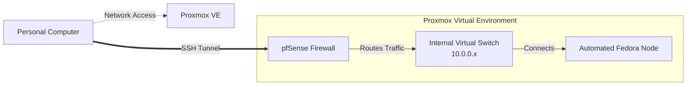

# Automated Infrastructure Provisioning Pipeline (IaC)

## Project Overview
This repository contains an Infrastructure as Code (IaC) pipeline that automates the provisioning of Fedora Linux nodes on a Proxmox Virtual Environment. It transforms a bare-metal hypervisor into a scalable, SSH-accessible server environment in under 45 seconds, eliminating manual provisioning errors and allowing for rapid deployment.

## Architecture


### Standardized Node Configuration
The Cloud-Init configuration ensures every deployed node adheres to a strict, immutable baseline upon first boot:
* **Automated Network Assignment:** IP addressing, gateway routing, and DNS configurations are injected dynamically, preventing IP conflicts.
* **Key-Based Authentication:** Password authentication is disabled by default, and SSH public keys are automatically mapped to the primary administrative user.
* **Minimal OS Footprint:** Uses a lightweight Fedora Cloud base image, reducing resource overhead and leaving maximum compute power for hosted services.

## Technology Stack
* **Hypervisor:** Proxmox VE 9.1.1
* **Infrastructure as Code:** HashiCorp Terraform (using the `bpg/proxmox` provider)
* **Operating System:** Fedora Linux (Cloud-Init Generic Image)

## Prerequisites
To run this pipeline, the following infrastructure must be present:
1. A Proxmox VE server accessible via API.
2. A Cloud-Init ready `.qcow2` template staged on the Proxmox hypervisor.
3. Terraform `v1.0+` installed on the control machine.

## Quick Start

**1. Clone the repository**
```bash
git clone https://github.com/adop05/proxmox_automation.git
cd proxmox_automation
```

**2. Configure Secrets**
Create a terraform.tfvars file in root directory.
```hcl
proxmox_api_url          = "https://<YOUR_PROXMOX_IP>:8006"
proxmox_api_token_id     = "root@pam!terraform"
proxmox_api_token_secret = "your-secret-token"
ssh_public_key           = "ssh-ed25519 AAAAC3N... your-key"
```

**3. Customize Network Configuration**
By default, the `main.tf` blueprint is configured for an isolated internal lab network (`10.0.0.x`). If you are deploying this to a standard flat home network, you **must** update the network settings before applying.

Open `variables.tf` and locate the `vm_ip_address`, `vm_gateway` and `vm_network_bridge` variables. Update them to match your physical network.

**4. Initialize and Deploy**
```bash
terraform init
terraform plan
terraform apply
```

**5. Access Node**
```bash
ssh fedora@<IP>
```

## Infrastructure Evolution
This automated pipeline serves as the fundamental layer for building out a highly available internal network. Because the provisioning loop takes under a minute, this repository can scale into:
* **High Availability (HA) Clusters:** Utilizing the Terraform `count` variable to spin up identical, concurrent nodes.
* **Configuration Management Integration:** Serving as the foundational infrastructure layer that hands off to Ansible for automated software package installation (e.g., internal DNS, web servers, or databases).
* **Automated Patch Management:** Safely destroying and re-provisioning nodes with updated base `.qcow2` images rather than manually patching live systems.
