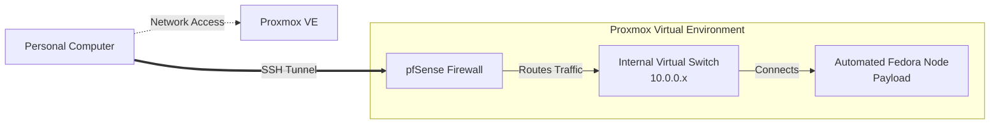

# Automated Defensive Security Lab (IaC)

## Project Overview
This repository contains an Infrastructure as Code (IaC) pipeline that automates the provisioning of secure Fedora Linux nodes on a Proxmox Virtual Environment. It transforms a bare-metal hypervisor into a ready-to-use, SSH-accessible server environment in under 45 seconds, eliminating manual provisioning errors and allowing for rapid deployment.

## Architecture



**Security & Routing:**
* **Privilege Separation:** API authentication is handled via scoped Proxmox API tokens.
* **Isolated Subnet:** Nodes are deployed to an internal virtual switch (`10.0.0.x`), isolated from the physical host network.
* **Immutable OS Configuration:** Host configuration, IP assignment, and SSH key injection are handled dynamically on boot via Cloud-Init.

## Technology Stack
* **Hypervisor:** Proxmox VE 9.1.1
* **Infrastructure as Code:** HashiCorp Terraform (using the `bpg/proxmox` provider)
* **Operating System:** Fedora Linux (Cloud-Init Generic Image)

## Prerequisites
To run this pipeline, the following infrastructure must be present:
1. A Proxmox VE server accessible via API.
2. A Cloud-Init ready `.qcow2` template staged on the Proxmox hypervisor.
3. Terraform `v1.0+` installed on the control machine.

## Quick Start

**1. Clone the repository**
```bash
git clone [https://github.com/adop05/proxmox_automation.git](https://github.com/adop05/proxmox_automation.git)
cd proxmox_automation
```

**2. Configure Secrets**
Create a terraform.tfvars file in root directory.
```hcl
proxmox_api_url          = "https://<YOUR_PROXMOX_IP>:8006"
proxmox_api_token_id     = "root@pam!terraform"
proxmox_api_token_secret = "your-secret-token"
ssh_public_key           = "ssh-ed25519 AAAAC3N... your-key"
```

**3. Costumize Network Configuration**
By default, the `main.tf` blueprint is configured for an isolated internal lab network (`10.0.0.x`). If you are deploying this to a standard flat home network, you **must** update the network settings before applying.

Open `variables.tf` and locate the `vm_ip_address`, `vm_gateway` and `vm_network_bridge` variables. Update them to match your physical network:

**4. Initialize and Deploy**
```bash
`terraform init`
`terraform plan`
`terraform apply`
```

**5. Access Node**
```bash
ssh fedora@<IP>
```
